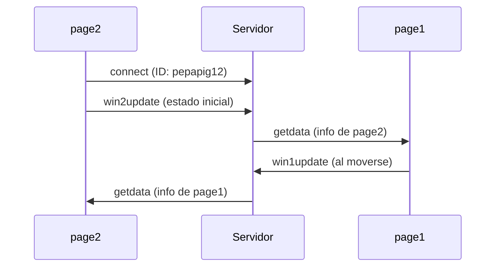

###  Solución Actividad 4 **  

#### **1. Conexión con el servidor**  
- **Error sin servidor**:  
  ```bash
  GET http://localhost:3000/socket.io/?EIO=4... net::ERR_CONNECTION_REFUSED
  ```  
  **Significado**: El cliente intentó conectarse, pero el servidor estaba apagado. ¡Como llamar a un teléfono desconectado!  

- **Con servidor activo**:  
  ```bash
  Connected to server - My ID: pepapig12 
  ```  
    gracias a l visto antes, puedo confirmar  que Socket.IO **necesita** el servidor para funcionar.  

---

#### **2. Estado inicial omitido**  
- **Prueba**: Comenté `socket.emit('win2update')` al conectar.  
- **Resultado**:  
  - `page1` mostró `page2` en la posición (0, 0) (valores por defecto).  
  - Solo al mover `page2`, `page1` actualizó la vista.  
- **hace**:  
  > **Enviar el estado inicial evita "ventanas fantasmas"**. Sin él, los demás clientes ven datos incorrectos hasta el primer movimiento.  

---

#### **3. Recepción de datos (`getdata`)**  
- **Al mover `page1`**:  
  ```bash
  Page 2 received data: {x: 200, y: 150, width: 800, height: 600}
  ```  
  - `page2` actualizó `remotePageData` y dibujó el círculo remoto en la posición correcta.  
- **Al mover `page2`**:  
  - **No hubo logs** en `page2`, porque `getdata` solo llega cuando **otro cliente** envía datos.  

---

#### **4. Detección de cambios inteligente**  
- **Log**:  
  ```bash
  Page 2 detected change, sending update: {x: 300, y: 200, ...}
  ```  
  - **Solo apareció al mover/resizar** la ventana, no en cada frame.  
- **¿Qué es lo que lo hace eficiente?**:  
  > **Evita spam de mensajes**. Comparar el estado actual con el anterior (`previousPageData`) ahorra ancho de banda.  

---

#### **5. Experimentos visuales**  
1. **Fondo como "radar"**:  
   ```js
   let distancia = resultingVector.mag();
   background(map(distancia, 0, 1000, 255, 0)); // Fondo más oscuro = ventanas más lejanas
   ```  
   **Resultado**: un efecto como de profundidad  

2. **Círculo que crece**:  
   ```js
   let tamaño = remotePageData.width / 4;
   drawCircle(point2[0], point2[1], tamaño);
   ```  
   **Pra tener en cuenta**: Si `page1` se maximiza, el círculo en `page2` se agranda.  

3. **Línea con color direccional**:  
   ```js
   stroke(resultingVector.x < 0 ? color(255, 0, 0) : color(0, 0, 255)); // Rojo si está a la izquierda, azul si a la derecha
   ```  
   **Feedback visual**: Identificación rápida de la posición relativa.  

---

### **Errores comunes y soluciones**  
| **Error**                          | **Causa**                          | **Solución**                     |  
|------------------------------------|------------------------------------|----------------------------------|  
| Círculo remoto en (0,0)            | Falta emitir estado inicial        | Asegurar `socket.emit()` en `connect` |  
| Línea mal dibujada                 | `resultingVector` no actualizado   | Verificar cálculo con `remotePageData` |  

---

### **Diagrama de flujo**  

- **Socket.IO** actúa como un "mensajero" entre ventanas.  
- **p5.js** usa los datos para dibujar en tiempo real.  
- **Optimización**: Enviar solo cambios reales hace la app más eficiente.  
